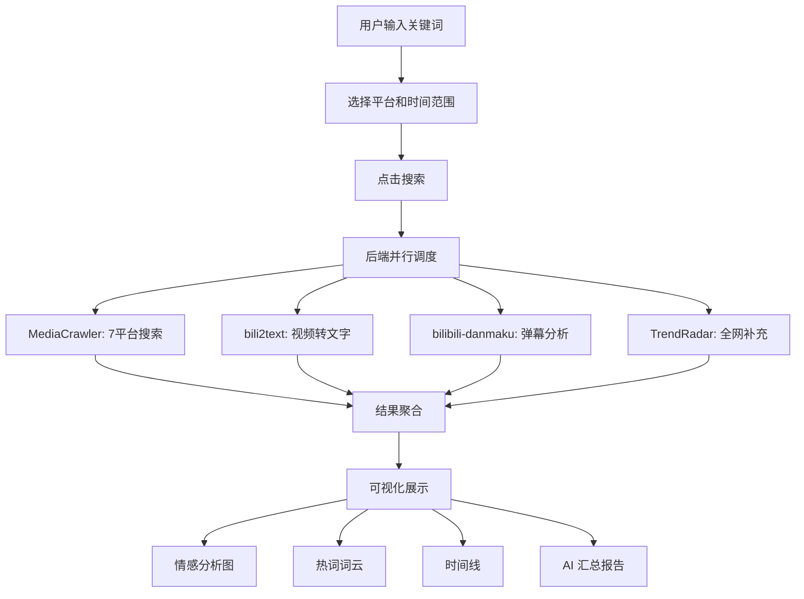

## 1. 产品概述

OSINT Radar 是一款开源情报聚合分析平台，整合知乎、B站、微博、贴吧、小红书、抖音、快手等主流中文平台的内容搜索、评论采集、视频转文字、弹幕情感分析能力，帮助用户快速获取关于特定话题的最新、最全面的情报信息，为决策提供数据支撑。

- 核心目标：一键查询 → 多平台实时采集 → 智能分析 → 可视化报告
- 目标用户：产品经理、市场分析师、AI 工具选型决策者、内容创作者、研究人员

## 2. 核心功能

### 2.1 用户角色

| 角色 | 注册方式 | 核心权限 |
|------|----------|----------|
| 普通用户 | 无需注册 | 搜索查询、查看报告、导出数据 |

### 2.2 功能模块

1. **搜索中心页**：关键词输入、平台选择、时间范围、搜索状态实时展示
2. **情报仪表盘页**：多平台结果聚合展示、情感分析图表、热词词云、时间线
3. **视频分析页**：B站视频转文字结果、弹幕情感分析、词云、舆情报告

### 2.3 页面详情

| 页面名称 | 模块名称 | 功能描述 |
|----------|----------|----------|
| 搜索中心 | 搜索栏 | 输入关键词，选择平台和时间范围，一键发起多平台搜索 |
| 搜索中心 | 平台选择器 | 7个平台开关（知乎/B站/微博/贴吧/小红书/抖音/快手） |
| 搜索中心 | 搜索历史 | 最近搜索记录，点击可快速重新查询 |
| 搜索中心 | 实时状态 | 各平台采集进度、成功/失败状态实时展示 |
| 情报仪表盘 | 平台结果卡片 | 按平台分组展示采集到的内容摘要和评论 |
| 情报仪表盘 | 情感分析图 | 饼图/柱状图展示各平台情感倾向分布 |
| 情报仪表盘 | 热词词云 | 基于采集内容生成的词云可视化 |
| 情报仪表盘 | 时间线 | 按时间排列的信息流，标注信息来源和时间 |
| 情报仪表盘 | AI 汇总 | 大模型生成的综合分析报告 |
| 视频分析 | 视频信息卡 | B站视频标题、UP主、发布时间、播放量 |
| 视频分析 | 转文字结果 | Whisper 语音识别的完整文字稿 |
| 视频分析 | 弹幕分析 | 弹幕情感分布、高频词、典型弹幕展示 |
| 视频分析 | 弹幕词云 | 弹幕关键词词云图 |
| 视频分析 | 舆情报告 | 自动生成的 Markdown 舆情分析报告 |

## 3. 核心流程

用户输入关键词 → 选择平台和时间范围 → 点击搜索 → 后端并行调度 MediaCrawler/bili2text/bilibili-danmaku/TrendRadar → 实时推送采集进度 → 前端展示聚合结果 → 生成可视化报告

## 4. 用户界面设计

### 4.1 设计风格

- **主色调**：深色科技风 — 深蓝黑底（#0a0e1a）+ 青色荧光（#00f0ff）+ 橙色强调（#ff6b35）
- **按钮风格**：圆角微光按钮，hover 时发光效果
- **字体**：标题用 JetBrains Mono（科技感），正文用 Noto Sans SC
- **布局风格**：左侧导航 + 右侧内容区，卡片式布局
- **图标风格**：线性图标 + 荧光描边
- **整体氛围**：情报监控中心 / 指挥中心风格，数据流动感

### 4.2 页面设计概览

| 页面名称 | 模块名称 | UI 元素 |
|----------|----------|---------|
| 搜索中心 | 搜索栏 | 大号输入框 + 荧光搜索按钮，背景粒子动效 |
| 搜索中心 | 平台选择器 | 7个平台图标卡片，选中时发光边框 |
| 搜索中心 | 搜索历史 | 玻璃态卡片列表，hover 时微光效果 |
| 搜索中心 | 实时状态 | 进度条 + 状态指示灯（绿/黄/红） |
| 情报仪表盘 | 平台结果卡片 | 深色卡片 + 平台图标 + 内容摘要 + 时间标签 |
| 情报仪表盘 | 情感分析图 | 环形图（正/中/负）+ 柱状图（按平台） |
| 情报仪表盘 | 热词词云 | 青色渐变词云，hover 显示频次 |
| 情报仪表盘 | 时间线 | 竖向时间线 + 节点发光 + 来源图标 |
| 情报仪表盘 | AI 汇总 | 玻璃态面板 + 打字机效果输出 |
| 视频分析 | 视频信息卡 | 视频缩略图 + 元信息 + B站风格标签 |
| 视频分析 | 转文字结果 | 代码风格文字展示，可折叠段落 |
| 视频分析 | 弹幕分析 | 情感饼图 + 高频词条形图 + 弹幕滚动展示 |
| 视频分析 | 弹幕词云 | 圆形词云 + 渐变色 |
| 视频分析 | 舆情报告 | Markdown 渲染 + 关键指标高亮 |

### 4.3 响应式

- 桌面优先设计，1920px 主分辨率
- 平板端（768px+）：卡片单列，侧边栏折叠
- 移动端（<768px）：底部导航，卡片堆叠

### 4.4 3D 场景

不适用
