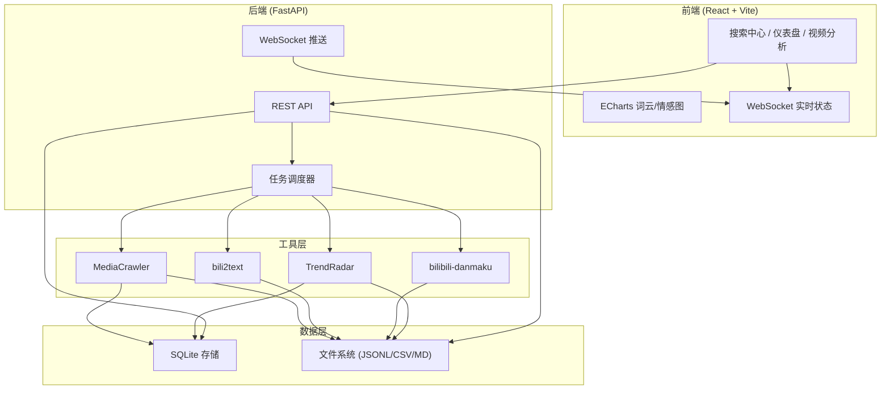
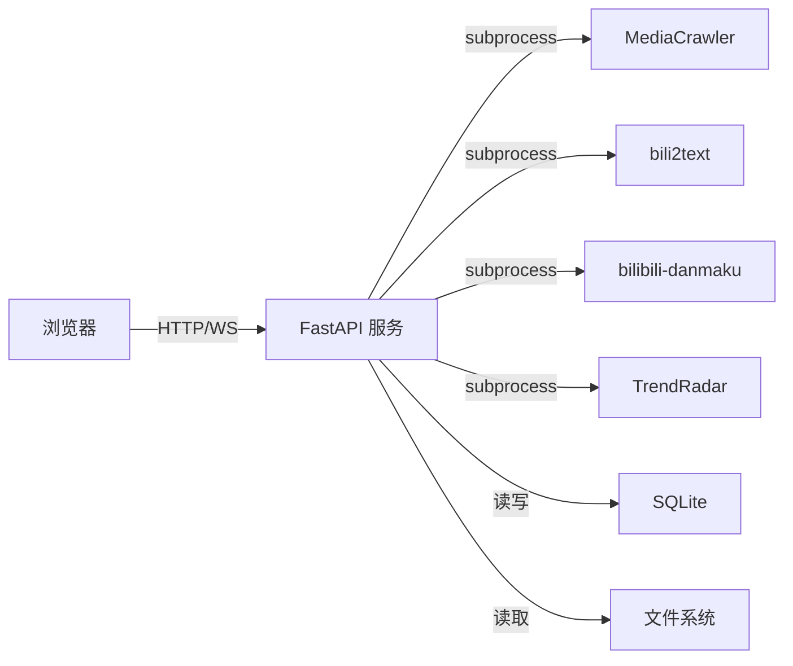
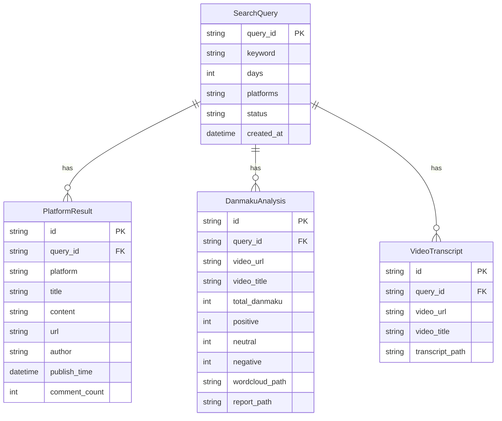

## 1. 架构设计



## 2. 技术说明

- **前端**：React@18 + Vite + TailwindCSS@3 + ECharts（图表）+ react-wordcloud（词云）
- **初始化工具**：Vite
- **后端**：FastAPI + WebSocket + subprocess（调用工具层）
- **数据库**：SQLite（轻量级，单文件部署）
- **实时通信**：WebSocket（采集进度推送）

## 3. 路由定义

| 路由 | 用途 |
|------|------|
| / | 搜索中心页 - 关键词搜索入口 |
| /dashboard/:queryId | 情报仪表盘 - 聚合分析结果展示 |
| /video/:videoId | 视频分析页 - B站视频详细分析 |

## 4. API 定义

### 4.1 搜索相关

```typescript
// 发起搜索
POST /api/search
Request: {
  keyword: string
  platforms: ("zhihu" | "bilibili" | "weibo" | "tieba" | "xhs" | "douyin" | "kuaishou")[]
  days: number  // 时间范围
  maxNotes: number
  maxComments: number
}
Response: {
  queryId: string
  status: "started"
}

// 获取搜索状态
GET /api/search/:queryId/status
Response: {
  queryId: string
  keyword: string
  platforms: {
    platform: string
    status: "pending" | "running" | "completed" | "error"
    progress: number  // 0-100
    resultCount: number
  }[]
  videoTranscription: {
    status: "pending" | "running" | "completed" | "skipped"
    results: { url: string; status: string }[]
  }
  danmaku: {
    status: "pending" | "running" | "completed" | "skipped"
    results: { url: string; status: string }[]
  }
}

// 获取搜索结果
GET /api/search/:queryId/results
Response: {
  queryId: string
  keyword: string
  queryTime: string
  mediaCrawler: {
    platforms: {
      [platform: string]: {
        items: {
          id: string
          title: string
          content: string
          url: string
          author: string
          publishTime: string
          commentCount: number
          comments: {
            content: string
            author: string
            time: string
            sentiment: "positive" | "neutral" | "negative"
          }[]
        }[]
      }
    }
  }
  danmaku: {
    videoUrl: string
    videoTitle: string
    totalDanmaku: number
    sentiment: { positive: number; neutral: number; negative: number }
    topWords: { word: string; count: number }[]
    wordcloudPath: string
    reportPath: string
  }[]
  videoTranscript: {
    videoUrl: string
    videoTitle: string
    transcript: string
  }[]
}
```

### 4.2 快捷操作

```typescript
// 快捷弹幕分析
POST /api/quick/danmaku
Request: { url: string }
Response: {
  taskId: string
  status: "started"
}

// 快捷视频转文字
POST /api/quick/transcribe
Request: { url: string }
Response: {
  taskId: string
  status: "started"
}

// 获取快捷任务结果
GET /api/quick/:taskId
Response: {
  taskId: string
  type: "danmaku" | "transcribe"
  status: "running" | "completed" | "error"
  result: any
}
```

### 4.3 搜索历史

```typescript
GET /api/history
Response: {
  queries: {
    queryId: string
    keyword: string
    queryTime: string
    platformCount: number
    totalResults: number
  }[]
}
```

### 4.4 WebSocket

```typescript
// 实时状态推送
WS /ws/search/:queryId
Server -> Client: {
  type: "progress"
  platform: string
  status: string
  progress: number
  message: string
}

Server -> Client: {
  type: "danmaku_progress"
  url: string
  status: string
  message: string
}

Server -> Client: {
  type: "transcribe_progress"
  url: string
  status: string
  message: string
}

Server -> Client: {
  type: "complete"
  queryId: string
}
```

## 5. 服务器架构



## 6. 数据模型

### 6.1 数据模型定义



### 6.2 数据定义语言

```sql
CREATE TABLE search_queries (
    query_id TEXT PRIMARY KEY,
    keyword TEXT NOT NULL,
    days INTEGER DEFAULT 7,
    platforms TEXT NOT NULL,
    status TEXT DEFAULT 'pending',
    created_at TIMESTAMP DEFAULT CURRENT_TIMESTAMP
);

CREATE TABLE platform_results (
    id TEXT PRIMARY KEY,
    query_id TEXT NOT NULL REFERENCES search_queries(query_id),
    platform TEXT NOT NULL,
    title TEXT,
    content TEXT,
    url TEXT,
    author TEXT,
    publish_time TIMESTAMP,
    comment_count INTEGER DEFAULT 0,
    raw_data TEXT
);

CREATE TABLE danmaku_analyses (
    id TEXT PRIMARY KEY,
    query_id TEXT NOT NULL REFERENCES search_queries(query_id),
    video_url TEXT,
    video_title TEXT,
    total_danmaku INTEGER DEFAULT 0,
    positive INTEGER DEFAULT 0,
    neutral INTEGER DEFAULT 0,
    negative INTEGER DEFAULT 0,
    avg_score REAL DEFAULT 0,
    wordcloud_path TEXT,
    report_path TEXT,
    top_words TEXT
);

CREATE TABLE video_transcripts (
    id TEXT PRIMARY KEY,
    query_id TEXT NOT NULL REFERENCES search_queries(query_id),
    video_url TEXT,
    video_title TEXT,
    transcript_path TEXT,
    status TEXT DEFAULT 'pending'
);

CREATE INDEX idx_platform_results_query ON platform_results(query_id);
CREATE INDEX idx_danmaku_query ON danmaku_analyses(query_id);
CREATE INDEX idx_transcripts_query ON video_transcripts(query_id);
CREATE INDEX idx_queries_created ON search_queries(created_at DESC);
```
